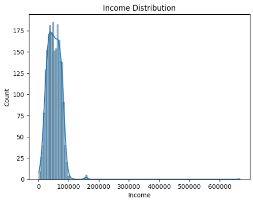
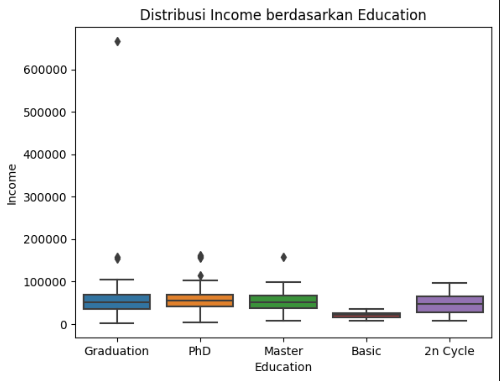

# Customer Personality Analysis-Statistical Analysis
 Exploratory Data Analysis, Hypothesis Testing, ANOVA, and T-Tests on Customer Personality Data
## Overview
This project demonstrates exploratory data analysis, hypothesis testing, one-way ANOVA, and T-tests using the Customer Personality dataset from Kaggle. The goal is to analyze the relationship between education and income, and to determine whether education level significantly affects income.

## Dataset
- Source: [Customer Personality Analysis](https://www.kaggle.com/datasets/imakash3011/customer-personality-analysis)
- Variables include customer demographics, product preferences, and income.

## Objectives
- Perform descriptive statistics and data exploration.
- Test hypothesis using one-way ANOVA to determine the relationship between education and income.
- Perform independent two-sample T-tests for hypothesis testing.
- Visualize data distributions and interpret the results.

## Steps
1. Data Cleaning: Handle missing values, outliers, and data types.
2. Descriptive Statistics: Explore data distribution with histograms and boxplots.
   

   Most of the incomes fall within the range of 30,000 to 80,000. The distribution is positively skewed, indicating that the majority of customers have relatively low incomes.
   

   Individuals with higher education levels such as Graduation, PhD, and Master tend to have higher incomes and more variability in their earnings. Outliers are prevalent in higher education levels.
4. Hypothesis Formulation:
   - H0: No significant difference in income across education levels.
   - H1: Significant difference in income across education levels.
5. One-Way ANOVA: Test income differences across multiple education levels.
6. Independent T-Test: Compare income between two specific education groups.
7. Interpretation: Draw conclusions from statistical tests.

## Conclusion 
Based on the statistical tests: 
1. The ANOVA test indicates that education level significantly affects income. 
2. The T-Test between Graduation and PhD education shows a significant difference in 
income. 
Overall, these results support that higher education levels are associated with higher income, and there 
is a significant difference between the education levels analyzed in this dataset.

## Files
- `notebook/`: Jupyter Notebook with the full analysis and code.
- `data/`: The dataset used for this project.
- `reports/Analysis_Report.pdf`: A summary report of the analysis.
- `images/`: Visualizations such as histograms, boxplots, etc.
